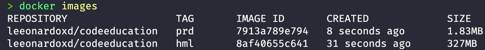

# FullCycle 3.0: Desafio Go



## Specs

#### Homolog image: **327MB 🥵**
#### Production image: **1.83MB 🎉**

## How it works

After clone this repo, follow the next steps to run the container:

```bash
# Homolog: 
docker build -t golang-hml . -f Dockerfile

# Production: 
docker build -t golang-prd . -f Dockerfile.prod
```

```bash
# Homolog:
docker run --rm golang-hml

# Production:
docker run --rm golang-prd
```